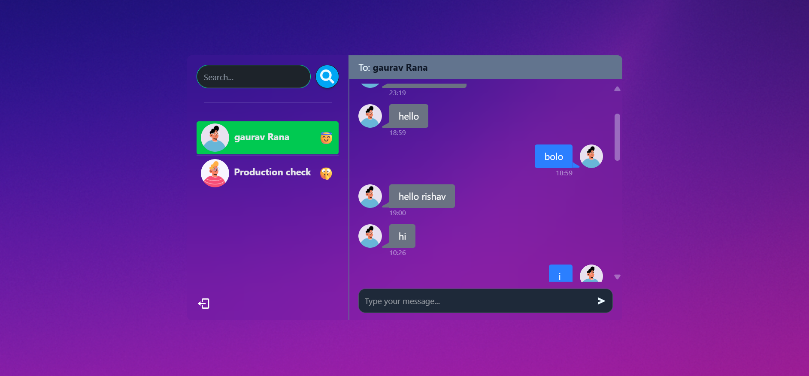

# 💬 DoChat - Real-Time Chat Application

A real-time full-stack chat application with user authentication, socket-based messaging, online status visibility, and emoji support — built using the MERN stack and Socket.IO.

🔗 [Live Demo](https://dochat-production.onrender.com)  


---

## ✨ Features

- 🔌 Real-time chat with **Socket.IO**
- 🟢 **Online/offline** user status tracking
- 🔔 **Sound notifications** for new messages
- 😍 Emoji support
- 🔐 Secure login & registration with JWT
- 🎨 Beautiful UI with responsive layout
- 🌐 Deployed and production ready

---

## 🖼️ Preview



---

## 🛠️ Tech Stack

**Frontend:**
- React + Vite
- Tailwind CSS
- Socket.IO Client
- Axios

**Backend:**
- Node.js
- Express.js
- MongoDB + Mongoose
- Socket.IO
- JWT for authentication

---

## 🚀 Getting Started

### Prerequisites

- Node.js
- MongoDB (Local or Atlas)
- npm

---

### Clone the Repository

```bash
git clone https://github.com/mayankRana26/DoChat.git
cd DoChat
